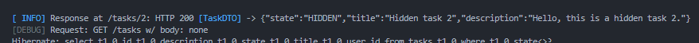
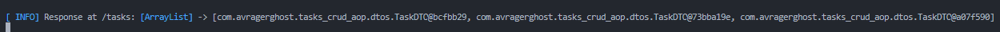

# Инфо

Аспекты логирования HTTP-запросов, перенесенные из [предыдущего проекта.](https://github.com/TheRagerghost/tasks-crud-aop)

# Задача

Перенос аспектов логирования в отдельный стартер.

### Чеклист

- @LogExecTime перенос из предыдущего проекта
- @LoggableService теперь логгирует ошибки во всех методах (сервиса)
- @LoggableController логгирует все методы (контроллера) - запросы и ответы
- @LoggableControllerMethod логгирует метод контроллера - запросы и ответы
- @LoggableRequest логгирует метод контроллера - запросы
- @LoggableResponse логгирует метод контроллера - ответы

### Результат

Пример ответа ResponseEntity из контроллера

Пример ответа Object из контроллера

